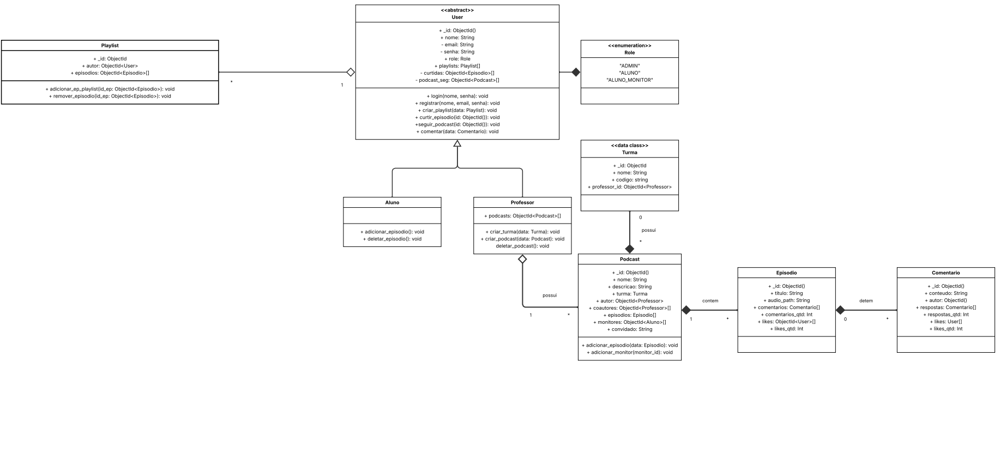

# 2.1. Módulo Notação UML – Modelagem Estática

## Diagrama de Classes - Versão 1.2

### Diagrama de Classes v1.2

<iframe src="https://drive.google.com/file/d/1jCb70_1PeZJJPaT0v77wyZ_1d3ogi2XC/preview" width="100%" height="400" allow="autoplay"></iframe>

<!-- 
<iframe allowfullscreen frameborder="0" style="width:640px; height:480px" src="https://lucid.app/documents/embedded/70b5b4d0-66ab-4e4c-b64f-42833122f217" id="HKSdg.QGsv3P"></iframe>
 -->

### Desenvolvimento do Diagrama de classes
Versões anteriores do Diagrama de classes:

Clique para apresentar a versão 1.1 do Diagrama de Classes

### Diagrama de classes v1.1

### Referências

[Lucidchart - UML Class Diagram Tutorial](https://www.lucidchart.com/pages/uml-class-diagram)

[UML Diagrams Org](https://www.uml-diagrams.org/)

[SERRANO, Millene. Arquitetura e Desenho de Software – Aula Modelagem UML Estática. Brasília: Universidade de Brasília (UnB), 2025. Aula digital. Disponível em: (inserir link). Acesso em: 7 maio 2025.](https://sigaa.unb.br/)z

[Visual Paradigm - UML Class Diagram Tutorial](https://www.visual-paradigm.com/guide/uml-unified-modeling-language/uml-class-diagram-tutorial/)

#### Histórico de versões 

| Versão |    Data    |        Descrição         |    Autor(es)    |  Revisor(es)     |  Detalhes da Revisão  |  
| :----: | :--------: | :----------------------: | :-------------: | :----------------| :---------------------|
|  1.0   | 06/05/2025 |   Criação do documento   | Gustavo Costa   | Harleny Angéllica| Versionamento revisado|
|  1.1   | 06/05/2025 |  Adição da primeira versão do Diagrama de Classes   | Gustavo Costa , Harleny Angéllica, Iderlan Junio  | Harleny Angéllica |Inclusão do Diagrama de Classes na seção 2.1 |
|  1.2   | 08/05/2025 | Adição da segunda versão do Diagrama de Classes |Natália Rodrigues, Marcella Anderle | Harleny Angéllica, Iderlan Junio | Correção de texto + alteração de frame |
|  1.3   | 08/05/2025 | Alterando documentos Embedded | Gustavo Costa, Iderlan Junio, Marcella Anderle | - | - |
|  1.4   | 08/05/2025 | Adicionando Referências    | Gustavo Costa, Iderlan Junio, Marcella Anderle,  Harleny Angéllica| - | - |

