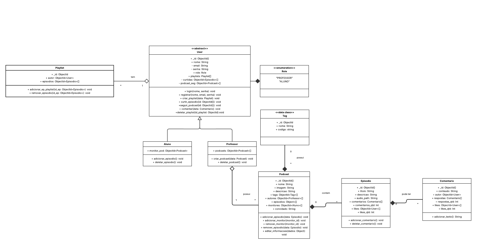

# 2.1. Módulo Notação UML – Modelagem Estática

Foco_1: Modelagem UML Estática.

Entrega Mínima: 1 Modelo Estático (ESCOPO: Diagrama de Classes; Diagrama de Componentes ou Diagrama de Implantação).

Apresentação (para a professora) explicando o modelo estático especificado, com: (i) rastro claro aos membros participantes (MOSTRAR QUADRO DE PARTICIPAÇÕES & COMMITS); (ii) justificativas & senso crítico sobre o modelo, e (iii) comentários gerais sobre o trabalho em equipe. Tempo da Apresentação: +/- 5min. Recomendação: Apresentar diretamente via Wiki ou GitPages do Projeto. Baixar os conteúdos com antecedência, evitando problemas de internet no momento de exposição nas Dinâmicas de Avaliação.

A Wiki ou GitPages do Projeto deve conter um tópico dedicado ao Módulo Modelagem Estática (Notação UML), com 1 modelo, histórico de versões, referências, e demais detalhamentos gerados pela equipe nesse escopo.

### Diagrama de Classes - Versão 1.2

### Desenvolvimento do Diagrama de classes
Versões anteriores do Diagrama de classes:

Clique para apresentar a versão 1.1 do Diaframa de Classes

### Diagrama de classes v1.1

#### Histórico de versões 

| Versão |    Data    |        Descrição         |    Autor(es)    |  Revisor(es)     |  Detalhes da Revisão  |  
| :----: | :--------: | :----------------------: | :-------------: | :----------------| :---------------------|
|  1.0   | 06/05/2025 |   Criação do documento   | Gustavo Costa   | Harleny Angéllica| Versionamento revisado|
|  1.1   | 06/05/2025 |  Adição da primeira versão do Diagrama de Classes   | Gustavo Costa , Harleny Angéllica, Iderlan Junio  | Harleny Angéllica |Inclusão do Diagrama de Classes na seção 2.1 |
|  1.2   | 08/05/2025 | Adição da segunda versão do Diagrama de Classes |Natália Rodrigues, Marcela Anderle | - | - |

