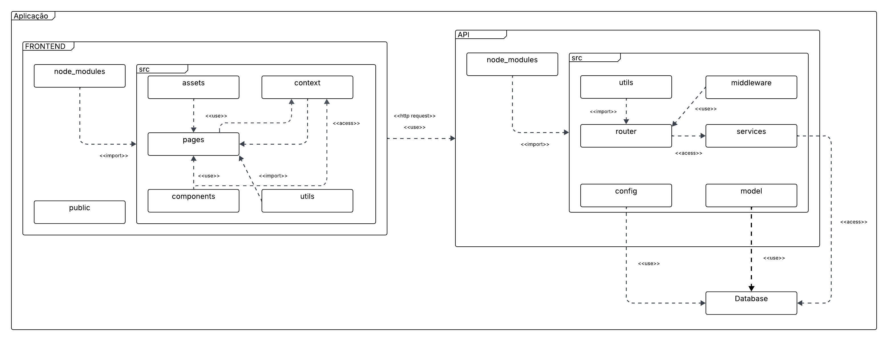

# 2.3. Módulo Notação UML – Modelagem Organizacional/Casos de Uso

## 📘 Documentação de Casos de Uso — FCTEPodcast

### 1. Introdução

Este documento descreve os casos de uso e o diagrama de pacotes do sistema **FCTEPodcast**, uma plataforma de gerenciamento que disponibiliza conteúdos acadêmicos por meio de podcasts. A documentação tem como objetivo detalhar os atores envolvidos, suas interações com o sistema e os principais fluxos de uso.

O sistema permite a autenticação de usuários, a interação com podcasts (como escutar, comentar e curtir), além de funcionalidades administrativas, como a criação de episódios, o gerenciamento de playlists e a atribuição de monitores.

---

### 2. Atores

Abaixo estão os atores identificados no sistema:

- **Usuário Autenticado**  
  Representa um usuário abstrato que possui todas as ações gerais.

- **Aluno**  
  O aluno pode fazer todos os cenários presente no Usuário Autenticado por meio do relacionamento entre atores.

- **Monitor**  
  Além das ações disponíveis ao aluno, pode adicionar episódios e possui ao **Painel Studio** . Atua como colaborador na gestão de conteúdo.

- **Professor**  
  Pode criar a Tag "Turma", com permissões administrativas como criação de podcasts e gerenciamento de monitores.

- **Convidado**  
  possui acesso limitado, pode visualizar quais são os podcasts em alta, escutar os episódios e compartilhar o podcast.

- **Serviço de Email**  
  Sistema automatizado responsável por enviar confirmações de cadastro, atuando como facilitador de autenticação.

---

### 3. Casos de Uso Principais

Os principais casos de uso do sistema estão organizados nas seguintes categorias:

### 🔐 Autenticação e Cadastro

- **Fazer Login**
  - Include: Verificar Login
  - Extend: Exibir Erro de Login

- **Fazer Cadastro**
  - Include: Verificar Cadastro
  - Extend: Exibir Erro de Cadastro

### 📱 Interações com Podcast

- Visualizar Podcast em Alta
- Escutar Episódio
- Compartilhar Podcast
- Curtir Episódio
- Seguir Podcast
- Comentar Episódio
- Responder Comentário

### 🛠️ Administração e Gerenciamento

- Criar Podcast
- Adicionar Episódio
- Adicionar Monitor ao Podcast
- Criar Tag "Turma"
- Criar Playlist
- Visualizar Painel Studio (somente Professor)

---

### 4. Diagrama Geral (Descrição)

O diagrama de caso de uso representa visualmente as interações entre atores e funcionalidades do sistema, destacando:

- **include**: Um caso de uso inclui outro como parte obrigatória de sua execução.
  - Exemplo: Fazer Login → inclui Verificar Login.
- **extend**: Um caso de uso pode estender outro como fluxo alternativo ou condicional.
  - Exemplo: Fazer Login → estende Exibir Erro de Login.

**Observações sobre o diagrama:**

- Ações como **Verificar Login** e **Verificar Cadastro** são sub-processos obrigatórios.
- Ações de erro como **Exibir Erro de Login/Cadastro** são opcionais e acionadas em caso de falha.
- O **Serviço de Email** atua nos bastidores enviando confirmações, não interagindo diretamente com a interface do usuário.
- O ator **Usuário Autenticado** é um ponto central de extensão para as funcionalidades acessadas após login.

---

## Caso de Uso - Versão Final

<iframe allowfullscreen frameborder="0" style="width:640px; height:480px" src="https://lucid.app/documents/embedded/05563167-0918-46ca-9da0-fab68ed9a4c3" id="fVQdzuLR1J3x"></iframe>

### Desenvolvimento do Diagrama de Caso de Uso
Versões anteriores do Diagrama de Caso de Uso:

Clique para apresentar a versão 1.1 do Diagrama de Caso de Uso

#### Diagrama de Caso de Uso v1.1

<iframe allowfullscreen frameborder="0" style="width:640px; height:480px" src="https://lucid.app/documents/embedded/b187723f-3c5c-4bd4-a086-5d9440306523" id="xPSdvuGCl794"></iframe>

---

## Diagrama de Pacotes

Este diagrama representa a arquitetura modular da aplicação de FCTEpodcast, dividida em dois grandes domínios principais: Frontend e API, cada um com seus respectivos pacotes e dependências.

### Frontend
O frontend é responsável pela interface do usuário e está organizado da seguinte forma:

- **node_modules**: Pacote de dependências externas usadas pelo frontend.

- **public**: Contém arquivos públicos estáticos.

- **src**: Diretório principal da lógica da interface:

  - *assets*: Recursos como imagens e estilos.

  - *context*: Controle de estado e provedor de contexto.

  - *pages*: Páginas principais da aplicação, que utilizam componentes e contexto.

  - *components*: Componentes reutilizáveis da interface.

  - *utils*: Funções auxiliares.
 
Há relações de importação, uso e acesso entre os pacotes. Por exemplo, pages importa de components e acessa context.

### API
A API gerencia a lógica de negócio e o acesso aos dados:

- **node_modules**: Dependências externas do backend.

- **src:**

  - *router*: Define as rotas da API.

  - *services*: Contém a lógica de negócio, acessando modelos e sendo usado pelas rotas.

  - *middleware*: Funções intermediárias aplicadas às rotas.

  - *utils*: Funções auxiliares usadas em vários pacotes.

  - *model*: Representa os modelos de dados utilizados.

  - *config*: Contém configurações gerais da aplicação.

A API realiza requisições HTTP e acessa diretamente o Database, onde os dados persistentes são armazenados.

#### Histórico de versões 

| Versão |    Data    |        Descrição         |    Autor(es)    |  Revisor(es)     |  Detalhes da Revisão  |  
| :----: | :--------: | :----------------------: | :-------------: | :----------------| :---------------------|
|  1.0   | 06/05/2025 |   Criação do documento   | Gustavo Costa | Harleny Angéllica  | Versionamento revisado|
|  1.1   | 08/05/2025 |   Adição da primeira versão do diagrama de casos de uso   | Iderlan Junio, Harleny Angéllica, Marcela | Gustavo Costa | Diagrama revisado com adição de novo ator abstrato|
|  1.2   | 08/05/2025 |   Adição da versão final do diagrama de casos de uso   | Iderlan Junio, Harleny Angéllica, Marcela, Gustavo Costa | - | - |
|  1.3   | 08/05/2025 |   Adição da documentação do Caso de Uso   | Iderlan Junio | Gustavo Costa, Harleny Angéllica | Texto Revisado e adicionando v.1 do diagrama |
|  1.4   | 08/05/2025 |   Adição da primeira versão do diagrama de pacotes e texto descritivo | Natália Rodrigues | - | - |

