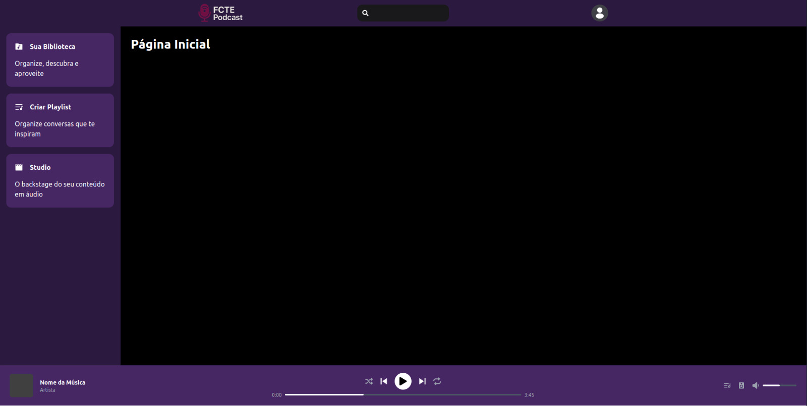
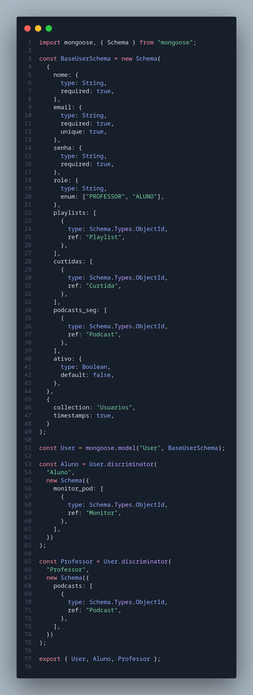
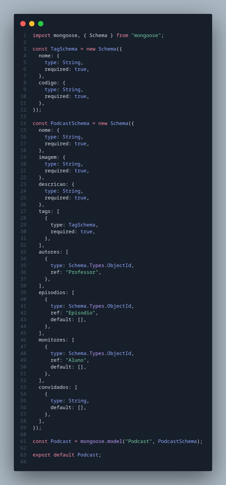
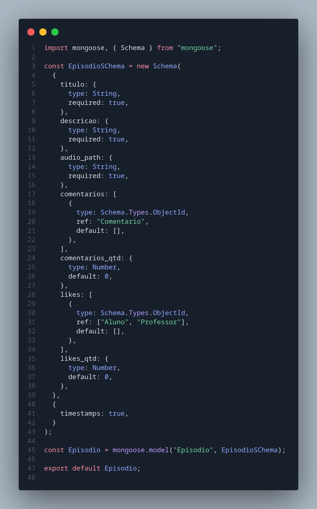
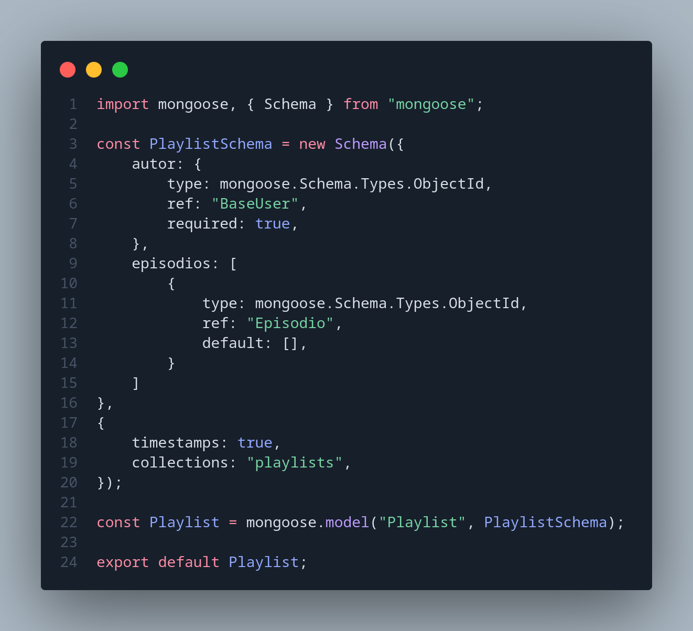

# 2.5. Iniciativas Extras (Modelagem)

## PBB - PRODUCT BACKLOG BUILDING

O projeto **FCTEPodcast** tem como objetivo principal resolver problemas enfrentados no contexto educacional relacionados à fragmentação e dificuldade de acesso a conteúdos em áudio, como podcasts. A proposta é desenvolver uma plataforma integrada que permita maior interação entre professores e alunos, facilitando o acesso a materiais educacionais em formato multimídia.

A elaboração deste backlog foi guiada pelo framework **Product Backlog Building (PBB)**, que utiliza como base as **personas** envolvidas no processo (professora, aluno e usuário anônimo), suas **atividades**, **expectativas** e os **problemas identificados** no cenário atual. Entre os principais desafios levantados estão:

- Dispersão de conteúdos em diversas plataformas;
- Falta de registro e organização de episódios;
- Dificuldade no acesso e na reutilização de conteúdos;
- Pouca interação entre os usuários.

A partir disso, foram definidas as seguintes **features principais**:

- **Acesso à plataforma**: garantindo segurança de dados, confiabilidade das informações e rastreamento de atividades.
- **Gerência de Podcast**: permitindo melhor organização dos episódios e controle dos conteúdos produzidos.
- **Acesso a podcasts (usuário logado e anônimo)**: com foco na democratização do conteúdo e acessibilidade.
- **Monitoramento**: fornecendo dados sobre o uso da plataforma para fins de acompanhamento educacional.

Cada feature foi desdobrada em **Product Backlog Items (PBIs)**, como por exemplo:

- Criar e acessar uma conta;
- Cadastrar e gerenciar podcasts;
- Comentar, curtir e compartilhar episódios;
- Pesquisar e reproduzir conteúdos;
- Responder a comentários e interagir com outros usuários.

Este backlog prioriza uma abordagem centrada no usuário, buscando desenvolver uma solução educacional eficiente, acessível e interativa, alinhada às reais necessidades dos envolvidos no processo de ensino-aprendizagem.

<iframe width="768" height="432" src="https://miro.com/app/live-embed/uXjVI40ueUE=/?moveToViewport=-20747,5135,5612,2803&embedId=986375486314" frameborder="0" scrolling="no" allow="fullscreen; clipboard-read; clipboard-write" allowfullscreen></iframe>

## Priorização do Backlog

Para priorizar o backlog do projeto, utilizamos a técnica MoSCoW, que consiste na classificação dos requisitos em quatro categorias: Must have (deve ter), Should have (deveria ter), Could have (poderia ter) e Won’t have for now (não terá por enquanto). Essa abordagem nos permitiu identificar dependências entre funcionalidades e organizar as entregas com foco nas mais essenciais, garantindo um desenvolvimento mais eficiente e alinhado com os objetivos do projeto.

<iframe width="768" height="432" src="https://miro.com/app/live-embed/uXjVI40ueUE=/?moveToViewport=-14717,5417,2048,2421&embedId=732877161983" frameborder="0" scrolling="no" allow="fullscreen; clipboard-read; clipboard-write" allowfullscreen></iframe>

## Home Page - FCTEPodcast

A página inicial da aplicação foi implementada com foco no layout e estilização; as funcionalidades ainda estão em desenvolvimento.

---

## Atualização dos modelos no Banco

Durante o desenvolvimento da modelagem, realizamos a atualização dos modelos com base no diagrama de classes, incluindo campos que estavam ausentes e refinando aqueles já existentes para melhor aderência ao projeto. Vale destacar que identificamos a possibilidade de implementar herança utilizando os discriminators do MongoDB, o que nos permitiu estruturar os modelos de forma muito próxima ao nosso diagrama original.

- Referência: [MongoDB - Herança](https://www.mongodb.com/pt-br/docs/mongoid/current/data-modeling/inheritance/)

# Correções Primeira Entrega

## Design Sprint

[Passos Anteriores...](https://unbarqdsw2025-1-turma01.github.io/2025.1-T01-_G7_FCTEPodcast_Entrega_01/#/Base/1.1.DesignSprint)

### Test - Verificação e Validação

O grupo entrou em contato com o professor Ricardo Fragelli (docente de Cálculo I e Introdução à Engenharia na UnB - FCTE) para validar os artefatos desenvolvidos. O professor demonstrou interesse no projeto e aprovou os materiais apresentados. Considerando que ele possui um podcast próprio, essa conexão representa uma oportunidade promissora de colaboração.

#### Histórico de versões 

| Versão |    Data    |        Descrição         |    Autor(es)    |  Revisor(es)     |  Detalhes da Revisão  | 
| :----: | :--------: | :----------------------: | :-------------: | :----------------| :---------------------|
|  1.0   | 06/05/2025 |   Criação do documento   | Gustavo Costa | Harleny Angéllica  | Versionamento revisado|
|  1.1   | 08/05/2025 |   Adição de PBB   | Gustavo Costa, Harleny Angéllica, Iderlan Junio | - | - |
|  1.2   | 08/05/2025 |   Adição de documentação do PBB   | Gustavo Costa, Harleny Angéllica, Iderlan Junio | - | - |
|  1.3   | 08/05/2025 |   Adição das alterações do Banco e da etapa de Verificação e Validação do Design Sprint, que ficou faltando na entrega passada | Gustavo Costa, Harleny Angéllica, Iderlan Junio, Marcella Anderle, Rafael Taira | - | - |
|  1.4   | 08/05/2025 | Adição da Priorização do Backlog | Gustavo Costa, Harleny Angéllica, Iderlan Junio, Marcella Anderle, Rafael Taira| - | - |
